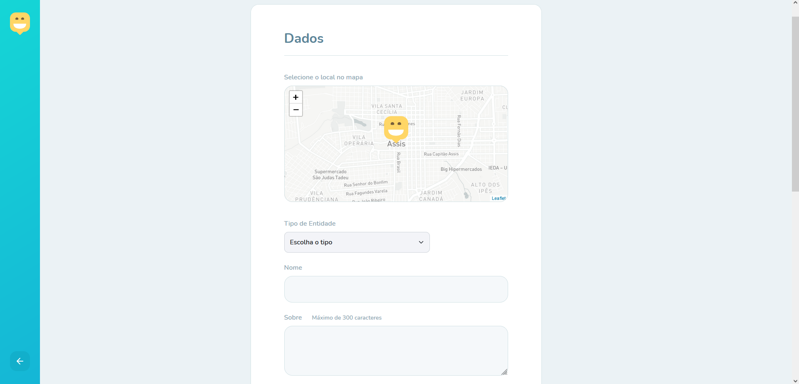
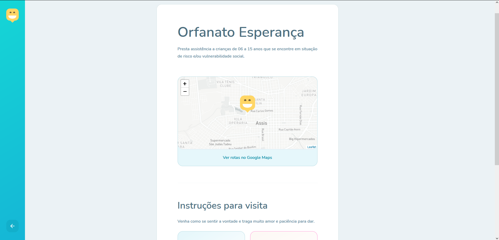

## 🚀 Screenshots

<h1 align="center">
    
    
    
    
</h1>

## 💻 Project

Happier é um aplicativo criado como projeto final para a disciplina de Programação Web 1 da UTFPR-CP, o projeto tem como inspiração a aplicação Happy, criada na Next Week Level 3, da [Rocketseat](https://www.rocketseat.com.br/)

## 🧪 Technologies

O projeto foi desenvolvido usando as seguintes tecnologias:

- [ReactJS](https://reactjs.org/)
- [Firebase](https://firebase.google.com/)
- [Axios](https://axios-http.com/)
- [Redux](https://redux.js.org/)
- [Mapbox](https://www.mapbox.com/)
- [Leaflet](https://react-leaflet.js.org/)

## 📝 License

This project is licensed under the MIT License. See the [LICENSE](LICENSE) file for details.
